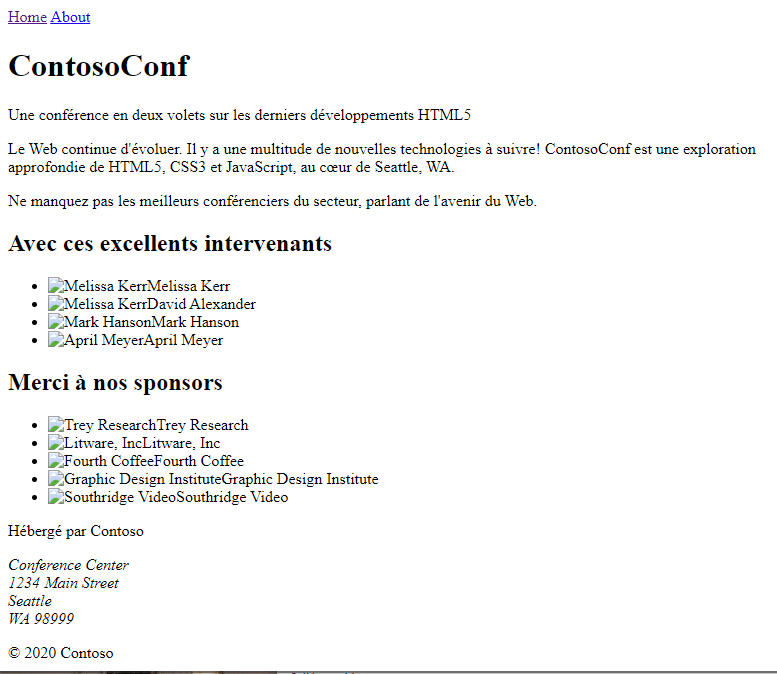
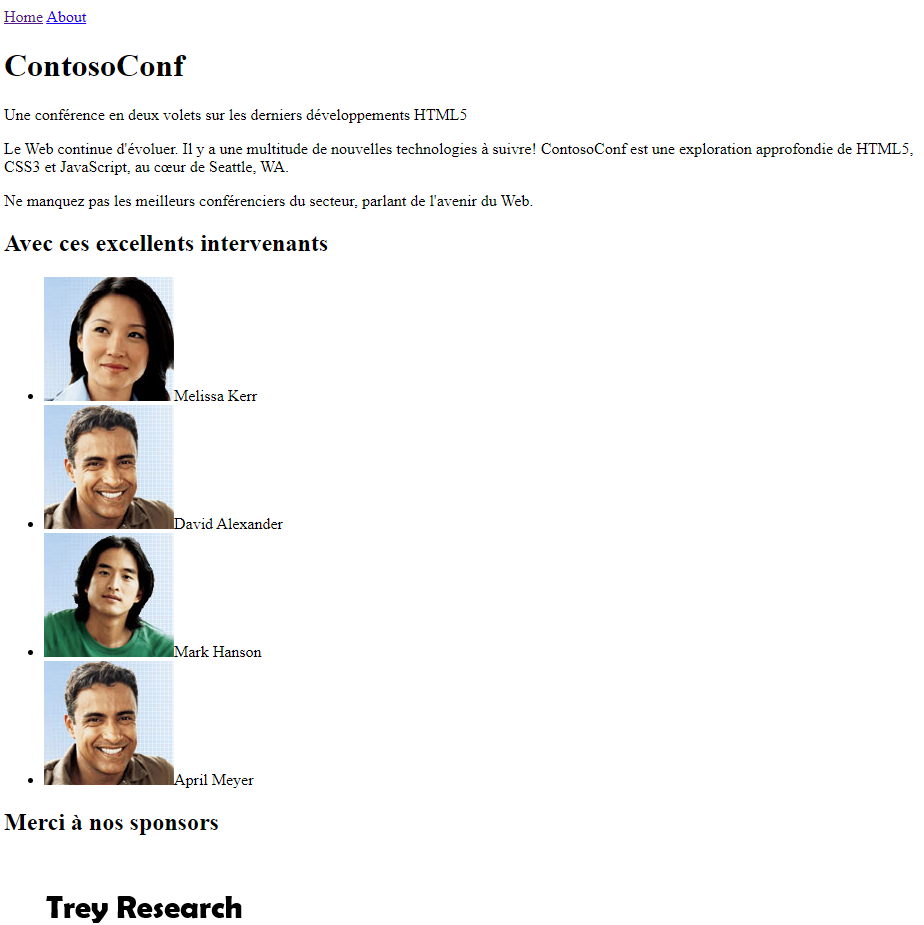
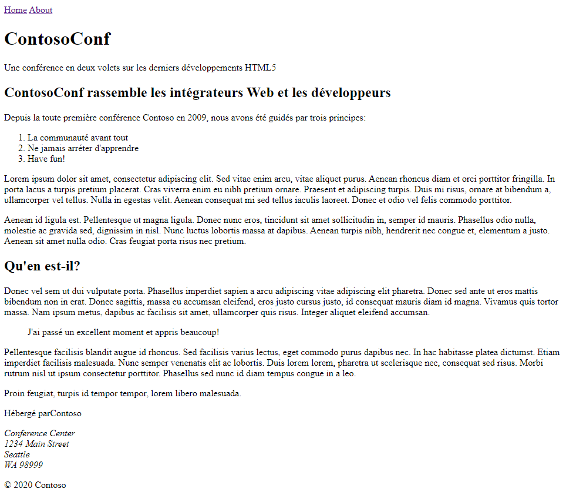
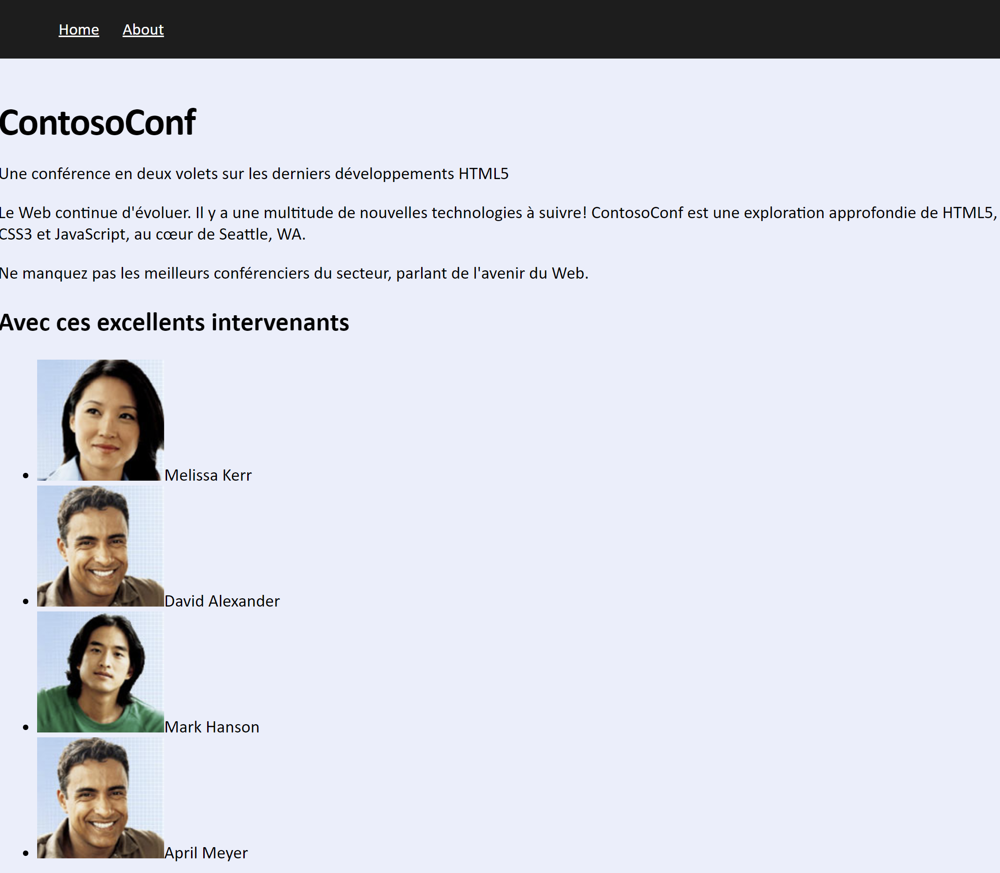
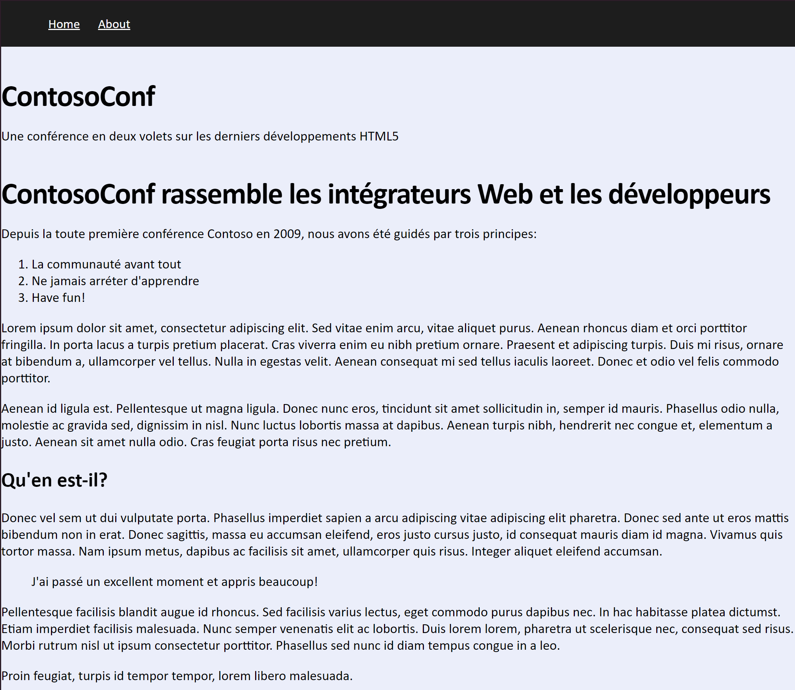

## Module 2: Création et mise en forme de pages HTML5
Partout où un chemin d'accès à un fichier commence par *[Repository Root]*, remplacez-le par le chemin absolu du dossier dans lequel réside le référentiel 20480. Par exemple, si vous avez cloné ou extrait le repository 20480 vers **C:\Users\John Doe\Downloads\20480**, changez le chemin: **[Repository Root]\AllFiles\20480C\Mod01** en **C:\Users\John Doe\Downloads\20480\AllFiles\20480C\Mod01**.

## Lab: Création et mise en forme de pages HTML5

#### Scenario

Vous êtes un développeur Web travaillant pour une organisation qui construit des sites Web pour gérer des conférences. Vous avez été invité à créer un site Web pour ContosoConf, une conférence qui présente les derniers outils et techniques de création d'applications Web HTML5. 

Vous décidez de commencer par créer un prototype de site Web composé d'une page  **Accueil** qui sert de page d'accueil pour les participants à la conférence et d'une page **À propos** qui décrit le but de la conférence. Dans les ateliers suivants, vous améliorerez ces pages et ajouterez des pages permettant aux participants de s'inscrire à la conférence et de fournir des informations sur les sessions de la conférence.

#### Objectifs

Après avoir terminé cet atelier, vous pourrez:
- Créer des pages.
- Styliser des éléments HTML5.

### Exercice 1: Création de Pages HTML5

#### Scenario
Dans cet exercice, vous allez commencer à créer le site Web ContosoConf.

En premier, vous allez créer une application Web. Ensuite, vous allez ajouter 2 fichiers HTML pour les pages **Accueil** et **A Propos**. Ensuite, vous ajouterez des liens de nvaigation vers ces pages. Enfin, vous exécuterez l'application web et vérifier que les pages **Accueil** et **A Propos** sont formatées convenablement.

#### Tâche 1: Créer une application web

1.	Lancez votre éditeur de texte préféré.
2.	Utilisez le dossier **[Repository Root]\Allfiles\Mod02\Labfiles\Starter\Exercise 1** comme dossier racine de votre application, et nommée cette dernière **ContosoConf**.  

#### Tâche 2: Ajouter la page d'accueil

1. Ajoutez une nouvelle page HTML, nommée **index.htm**, dans votre projet ContosoConf. Cette page devra être la page par défaut de votre application web et devra s'afficher lorsqu'un utilisateur saisisra l'url de votre site web.
2. From the **[Repository Root]\Allfiles\Mod02\Labfiles\Starter\Exercise 1\Resources** folder, open the **index.txt** file in Notepad. 
3. Examine this file and add HTML5 elements to the **index.htm** file by using a web application that can display the items specified in the **index.txt** file. 
4. Utilisez les elements HTML5 comme **&lt;header&gt;**, **&lt;section&gt;**, et **&lt;footer&gt;** afin la structure de votre page ressemble à l'image ci-dessous:
 

#### Task 3: Ajoutez des images à la Page d'accueil

1.	Ajoutez les images concernant les intervenant et les sponsors images à votre projet ContosoConf. vous pouvez trouver ces images dans le dossier **[Repository Root]\Allfiles\Mod02\Labfiles\Starter\Exercise 1\Resources**. Ajoutez ces images un dossier nommé, **images**, dans votre projet.
2.	Votre page doit ressembler à  cela:

#### Tâche 4: Ajouter la page A Propos

1.	Ajoutez une nouvelle page HTML, nommée **about.htm**, dans votre projet ContosoConf.
2.	Ajoutez les éléments HTML adéquats dans **about.htm** en utilisant le texte présent dans le fichier **about.txt**, qui est situé dans le dossier **[Repository Root]\Allfiles\Mod02\Labfiles\Starter\Exercise 1\Resources**.
3. Ajoutez un titre aproprié à votre page.
4. Afin d'avoir une mise en page cohérente avec la page d'accueil, copiez depuis **index.htm**, les éléments **&lt;header&gt;** et **&lt;footer&gt;**.
5. Utilisez les éléments **&lt;article&gt;**, **&lt;blockquote&gt;**, et **&lt;ol&gt;** afin que votre page ressemble à la capture ci-dessous.

#### Tâche 5: Ajoutez des liens de navigation

Ajoutez une élément de navigation aux pages **index.htm** et **about.htm**. Cet élément de navigation doit contenir des liens vers les 2 pages.

#### Tâche 6: Exécuter et tester l'application

1.	Affichez votre application web dans votre navigateur
2.	Vérifiez que les images et le texte s'affichent correctement.
3.	Vérifiez que les liens de navigation pointent vers les bonnes pages.

>**Résultat**: Après avoir terminé cet exercice, vous aurez créé une application Web HTML5 simple avec une page **Accueil** et une page **À propos**.

### Exercice 2: Styliser des pages HTML pages

#### Scenario

Dans cet exercisc, vous allez styliser les pages **Accueil** et **A Propos**.

Vous allez créer une feuille de style dnas votre projet ContosoConf. Puis vous allez ajoter des règles CSS rules pour mettre en forme les pages **Accueil** et **A Propos** afin qu'elles respectent la mise en page désirée. Enfin, vous exécuterez l'application web et vérifier que les pages **Accueil** et **A Propos** sont formatées convenablement.

#### Tâche 1: Créer une nouvelle feuille de style

1.	Dans le projet ContosoConf, ajoutez un nouveau dossier nommé, **styles**.
2. Dans le dossier **styles**, ajoutez une feuille de style nommée, **site.css**.
3. Dans les fichiers **index.htm** et **about.htm**, ajoutez un lien pointant vers la feuille de style **site.css**.

#### Tâche 2: Ajoutez des règles CSS pour styliser les pages

1.	pour mettre en forme l'élément **&lt;html&gt;** des pages **Accueil** et **A Propos**, ajoutez une règle css dans la feuille de style **site.css** afin que dans les 2 pages:
- La couleur d'arrière plan des pages doit avoir pour valeur **#EAEEFA**, les polices disponibles doivent être **Calibri**, **Arial**, **sans-serif**, et la taille de la police doit avoir pour valeur **62.5%**.
2.	Pour styliser l'élément **&lt;body&gt;**, ajoutez une règle css afin que:
- la marge soit de  **0** ezt la taille de la police soit de **1.8rem**.
3.	Pour styliser l'élément **&lt;nav&gt;**, ajoutez une règle css afin que:
- La couleur d'arrière plan des pages doit avoir pour valeur **#1d1d1d**, La propriété **line-height** doit être de **6rem**, la taille de la police doit avoir pour valeur **1.7rem**.
- Ajoutez également un style pour que tous les liens hypertexte au sein de l'élément **&lt;nav&gt;** s'affiche avec la couleur **#fff** et possède un **padding** de **1rem**.

4.	Pour styliser l'élément **&lt;h1&gt;** des pages web, ajoutez une règle css dans la feuille de style **site.css** afin que dans les 2 pages 
- la taille du texte soitr de **4rem**, **letter-spacing** soit de  **-1px**, et la marge possède la valeur **1em 0 0,25em 0**.
5.	Faites en sorte que les liens de navigation apparaissent l'un à coté de l'autre. Vous devrez modifier le code HTML et utiliser un style de classe nommé **container** 
6.	la classe CSS **container** doit donner un effet de colonne de largeur fixe centré horizontalement :
- Le **padding** doit être de **0.1rem**, affectez à la propriété **max-width** la valeur **94rem**, la propriété **margin** doit avoir la valeur **0 auto**.

>**Note**: Utilisez l'expression **.container** comme sélecteur de la règle CSS.

>**Note**: Pensez à utilisez F12 pour afficher les "developer tools" et tester les règles CSS jusqu'à ce que vous obtenniez le résultat attendu.

#### Tâche 3: Exécuter et tester l'application

Exécutez votre application web et vérifiez que les pages **Accueil** et **A Propos** s'affichent convenablement.

>**Result**: Après avoir terminé cet exercice, vous aurez utilisé des règles CSS pour styliser les pages **Accueil** et **À propos**.

