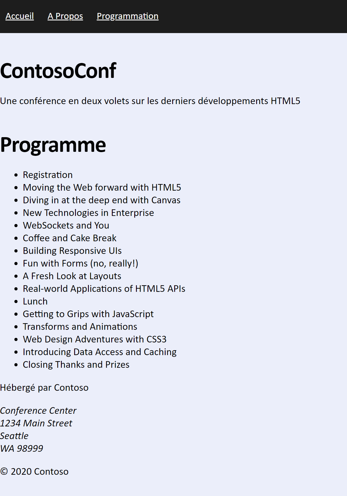
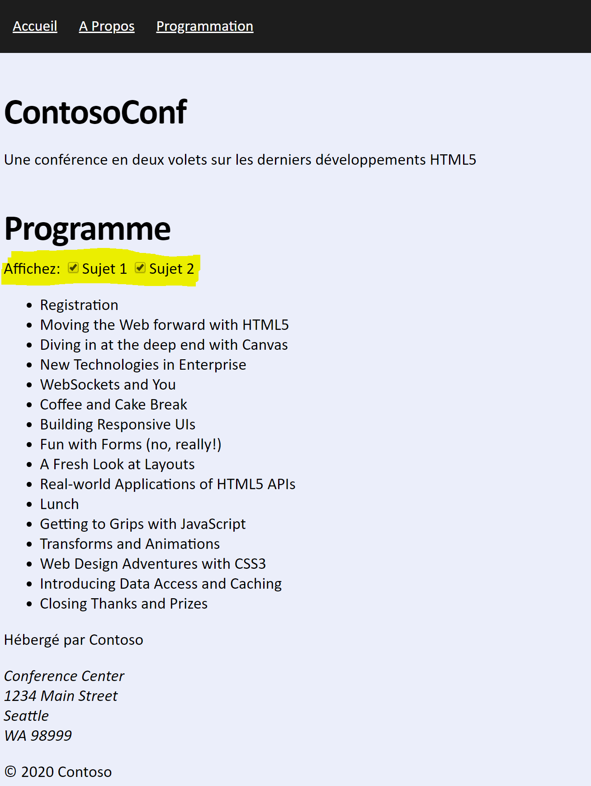

## Module 3: Introduction à JavaScript
Partout où un chemin d'accès à un fichier commence par *[Repository Root]*, remplacez-le par le chemin absolu du dossier dans lequel réside le référentiel 20480. Par exemple, si vous avez cloné ou extrait le repository 20480 vers **C:\Users\John Doe\Downloads\20480**, changez le chemin: **[Repository Root]\AllFiles\20480C\Mod02** en **C:\Users\John Doe\Downloads\20480\AllFiles\20480C\Mod03**.


## Lab: Affichage de données et Gestion des événements en utilisant JavaScript

#### Scenario

LA conférence qui doit être organisée par ContosoConf consiste en un certain nombre de sessions organisées par thème. Un thème regroupe des sessions relatives à une technologie et les participants à la conférence peuvent visualiser les sessions d'un thème pour déterminer celles qui peuvent les intéresser le plus. 

Pour aider les participants à la conférence, vous avez été invité à ajouter une page de **Programme** qui répertorie les thèmes et les sessions de la conférence sur le site Web ContosoConf.

#### Objectifs

Après avoir achevé cet atelier, vous serez alors capable de :
- Utilisez du code JavaScript pour mettre à jour par programme les données affichées sur une page HTML5.
- Gérez les événements qui peuvent se produire lorsqu'un utilisateur interagit avec une page à l'aide de JavaScript.

### Exercice 1: Affichage des données par programme

#### Scenario

Dans cet exercice, vous allez créer la page **Programme** qui affiche une liste de sessions.

Tout d'abord, vous utiliserez le DOM HTML5 pour obtenir une référence à l'élément de liste de  de la page programme. Ensuite, vous implémenterez une fonction qui crée des éléments de liste (un élément de liste pour chaque session). Les informations sur les sessions sont stockées dans un fichier au format JSON. Vous allez implémenter une fonction qui lit ces données et ajoute les détails de chaque session à l'élément liste. Enfin, vous allez exécuter l'application et afficher la page **Programme** pour vérifier qu'elle affiche correctement la liste des sessions.

#### Tâche 1: Créer un nouveau fichier pour la page Programme

1.	Ajoutez un fichier html nommé **Schedule.htm** pour créer une page **Programme** dans votre projet.

2.  Ajoutez le code hml permettant à votre page **Programme** d'afficher les mêmes éléments *header*, *nav* et *footer* que les autres pages.

3.  Ajoutez une section qui contient une div. Au sein de cet élément div, ajoutez le titre **Programme** et une liste vide ayant pour identifiant **schedule**:
    ```html
        <section class="page-section schedule>
            <div class="container">
                <h1>Schedule</h1>
                <ul id="schedule"></ul>
            </div>
        </section>
    ```
3.	Dans la page **schedule.htm** le fichier de type JavaScript  **scripts\pages\schedule.js**:
    ```html
        <script src="/scripts/pages/schedule.js" type="text/javascript"></script>
    ```
4.	Affichez le fichier de script **scripts\pages\schedule.js**. Ce fichier contient les détails de chacune des session de la conférence au format JSON. Les données sont conservées dans le tableau **schedule** et chaque objet du tableau possède trois propriétés qui spécifient l'ID de session, le titre de la session et les thème auxquelles appartient la session(Une session peut être associée à un ou plusieurs thèmes):
    ```javascript
        const schedule = [
            {
                "id": "session-1",
                "title": "Registration",
                "tracks": [1, 2]
            },
            {
                "id": "session-2",
                "title": "Moving the Web forward with HTML5",
                "tracks": [1, 2]
            },
            {
                "id": "session-3",
                "title": "Diving in at the deep end with Canvas",
                "tracks": [1]
            },
            {
                "id": "session-4",
                "title": "New Technologies in Enterprise",
                "tracks": [2]
            },
            ...
        ];
    ```

#### Task 2: Write code to get the schedule list element on the Schedule page

1.  Dans le fichier **schedule.js**, trouvez le commentaire **TODO: Task 2**.

2.	Écrire le code permettant de retrouver dans le DOM une liste nommée **schedule** et de l'affecter à une variable nommée *list*. Vous utiliserez cette variable pour afficher les détails de chaque session dans la liste de la page **Planification**. 

#### Tâche 3: Implémenter la fonction createSessionElement qui crée un élément de liste pour une session 

1.	Dans le fichier **schedule.js**, trouvez le commentaire **TODO: Task 3**. Il est situé dans la fonction **createSessionElement**, qui se présente comme cela:
    ```javascript
        function createSessionElement(session) {
            ...
        };
    ```
>**Note**: L'objectif de la fonction **createSessionElement** est de créer un élément de type list qui contient le nom de la session passée enparamètre.

2.	Ajoutez le code Javascript permettant de créer un élément de type **&lt;li&gt;**, affectez à son contenu le titre de la session et renvoyerset its text content to the session title, et renvoyez cet élément.

#### Tâche 4: Implémentez la fonction displaySchedule qui ajoute des éléments de session à la liste pour l'affichage

1.	Dans le fichier **schedule.js**, trouvez le commentaire **TODO: Task 4**. Il est situé dans la fonction **displaySchedule**, qui se présente comme cela:
    ```javascript
        function displaySchedule () {
            clearList();

            ...
        };
    ```
>**Note**: L'objectif de la section **displaySchedule** est d'afficher le titre de chaque session dasn l'élément de type liste de la page **Programmation**.

2.	Ajoutez le code JavaScript qui itère le tableau JSON, nommé **schedule**, qui contient les données de toutes les sessions. A chaque itération, créez un objet **session** pour chaque élément du tableau, et ajoutez alors le titre de la session à l'élément de type **list** de la page **Programmation**.


#### Tâche 5: Exécuter l'application et afficher la page Programmation

Exécuter l'application et afficher la page **Programmation.htm** pour vérifier que la liste des sessions s'affiche convenablement.



>**Note**: N'oubliez pas que vous pouvez utiliser les outils de développement de votre navigateur en utilisant la touche F12 de votre navigateur.


>**Résultat**: Après avoir terminé cet exercice, vous aurez ajouté une page **Planification** à l'application ContosoConf qui affiche les détails des sessions de conférence

### Exercise 2: Gestion des événements

#### Scenario

Dans cet exercice, vous allez ajouter des cases à cocher à la page **Planification** pour permettre à l'utilisateur de spécifier les sessions à afficher, en fonction des thèmes dans lesquelles elles se trouvent. 

Tout d'abord, vous allez ajouter deux éléments HTML de type case à cocher à la page **Planification**. La première case à cocher permettra à l'utilisateur de spécifier que les sessions de le thème 1 doivent être affichées. La deuxième case à cocher permettra à l'utilisateur de spécifier que les sessions de la session 2 doivent être affichées. (Si les deux cases sont cochées, les sessions pour le thème 1 et le thème 2 seront répertoriées.). Ensuite, vous ajouterez du code JavaScript pour gérer les événements de clic de ces cases à cocher. Pour afficher uniquement les sessions spécifiées à l'aide des cases à cocher, vous mettrez à jour la fonction **displaySchedule**. Enfin, vous exécuterez l'application et afficherez la page **Planification** pour vérifier que la sélection et la désactivation des cases à cocher mettent correctement à jour la liste des sessions.
 

#### Tâche 1: Ajouter des éléments HTML de type case à cocher


2.	Dans le fichier **schedule.htm**, avant la liste **schedule**, ajoutez 2 case à cocher qui permettent à l'utilisateur de spécifier le thème des sessions pour lesquelle il veut faire des informations:



3. Ajoutez aux 2 cases à cocher les étiquettes **Thème 1** et **Thème 2**.
4. Affectez aux cases à cocher un attribut **id** ayant pour valeur respectivement **show-track-1** et **show-track-2**.
5. Faites en sorte que les 2 cases à cochées soient sélectionnées par défaut.

#### Tâche 2: Écrivez du code pour obtenir les éléments html de type case à cocher de la page **Planification**.

1.	Dans le dossier **scripts\pages**, ouvrez le fichier **schedule.js**.
2.	Après la définition de la variable *list*, créez 2 variables nommée: *track1Checkbox* et *track2Checkbox*.
3.	Ajoutez du code JavaScript code, permettant d'obtenir les 2 éléments de type case à cocher **show-track-1** et **show-track-2** à partir du DOM et affectez les 2 aux 2 variables.

#### Tâche 3: Abonnez vous au clic sur chaque case à cocher

1.	A la fin du fichier **schedule.js** file, ajoutez un event listener pour l'événement clic de chaque case à cocher. Le gestionnaire d'événement de chaque case à cocher doit appeler la fonction **displaySchedule**.


#### Tâche 4: Meetez à jour la fonction displaySchedule pour afficher les sessions des thèmes sélectionnés

1.	Pour ajouter des sessions à la liste uniquement lorsqu'elles se trouvent dans les thèmes actuellement sélectionnées, modifiez la fonction **displaySchedule** (un thème, les deux thèmes ou aucun thème peuvent être sélectionnées).
2. Pour déterminer quel thème l'utilisateur a sélectionné, examinez le propriété **checked** des éléments **track1Checkbox** et **track2Checkbox**.
3. Le paramètre **session** qui est passé à la méthode **createSessionElement** possède une propriété **tracks**. Cette propriété est un tableau qui spécifie la ou les thèmes auxquels appartient une session..

#### Tâche 5: Exécuter l'application et afficher la page Programmation

1.	Exécutez l'application et affichez la page **schedule.htm**.
2.	Vérifiez que si les deux cases sont cochées, toutes les pistes sont affichées.
3.	Vérifiez que si  seulement **Thème 1** ou seulement **Thème 2** est sélectionné, seules les sessions de ce thème sont affichées.
4.	Vérifiez que si aucun thèmes n'est sélectionné, aucune session n'est affichée.


>**Note**: Les sessions du Thème 1 sont:
>- Registration
>- Moving the Web forward with HTML5
>- Diving in at the deep end with Canvas
>- WebSockets and You
>- Coffee and Cake Break
>- Building Responsive UIs
>- A Fresh Look at Layout
>- Lunch
>- Getting to Grips with JavaScript
>- Web Design Adventures with CSS3
>- Closing Thanks and Prizes
>
>Les sessions du Thème 2 sont:
>- Registration
>- Moving the Web forward with HTML5
>- New Technologies in Enterprise
>- Coffee and Cake Break
>- Fun with Forms (no, really!)
>- Real-world Applications of HTML5 APIs
>- Lunch
>- Transformations and Animations
>- Introducing Data Access and Caching
>- Closing Thanks and Prizes

>**Résultat**: Après avoir terminé cet exercice, vous aurez mis à jour la page **Planification** pour filtrer les sessions en fonction des pistes sélectionnées.


