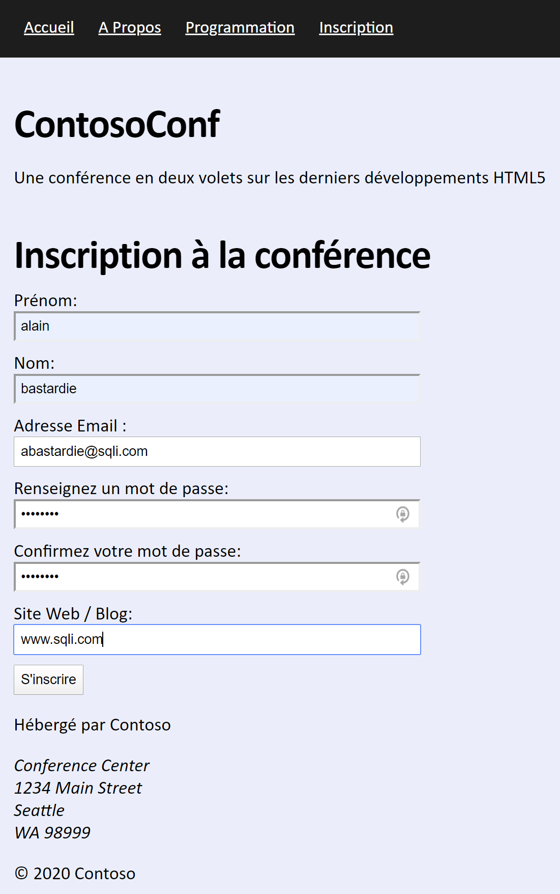
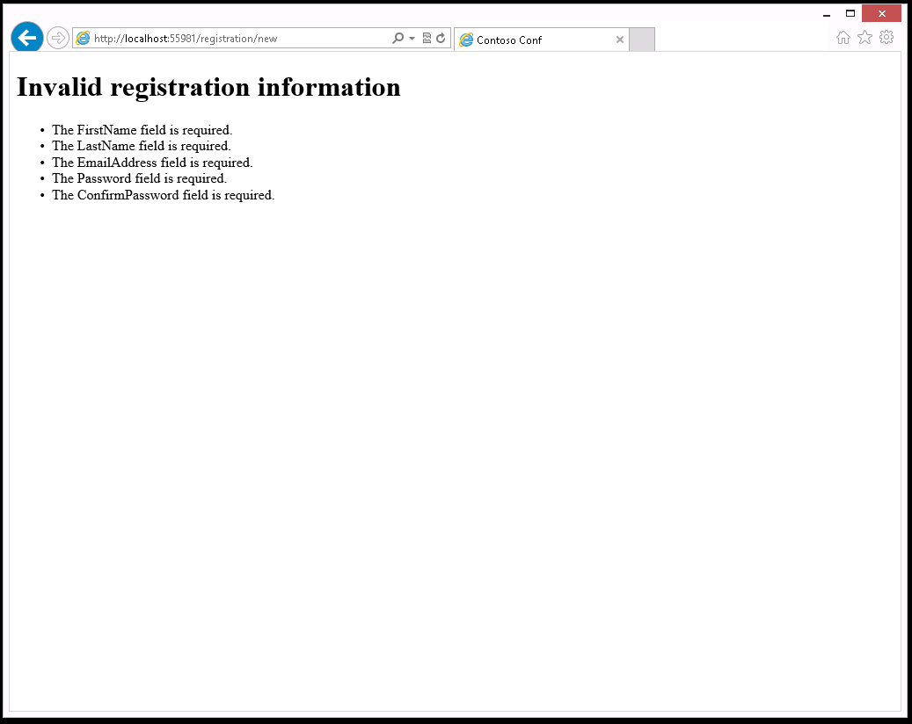
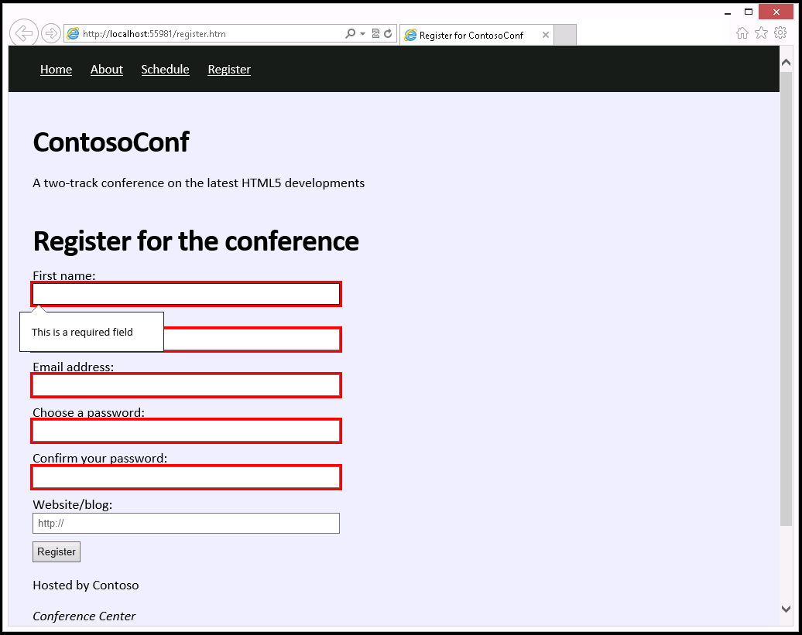
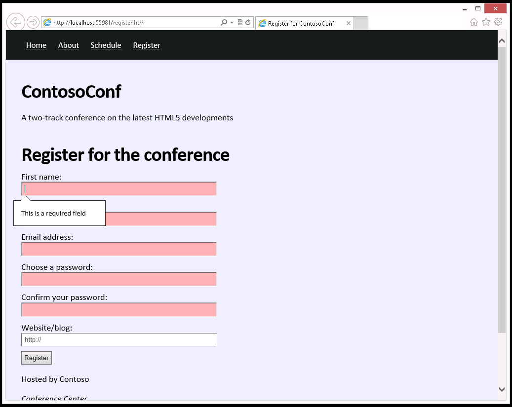

## Module 4: Création de formulaires pour collecter et valider les entrées utilisateur

Partout où un chemin d'accès à un fichier commence par *[Repository Root]*, remplacez-le par le chemin absolu du dossier dans lequel réside le référentiel 20480. Par exemple, si vous avez cloné ou extrait le repository 20480 vers **C:\Users\John Doe\Downloads\20480**, changez le chemin: **[Repository Root]\AllFiles\20480C\Mod02** en **C:\Users\John Doe\Downloads\20480\AllFiles\20480C\Mod03**.

## Lab: Créeer un Formulaire et Valider les entrées des utilisateurs

#### Scenario

Les délégués qui souhaitent participer à ContosoConf devront s'inscrire et fournir leurs coordonnées. Vous avez été invité à ajouter une page sur le site Web ContosoConf qui implémente un formulaire d'inscription de participant.

Le code côté serveur existe déjà pour traiter les données des participants. Cependant, la page d'inscription effectue une validation minimale et n'est pas conviviale. Vous avez décidé d'ajouter une validation côté client au formulaire pour améliorer la précision des données d'inscription saisies par les participants et pour offrir une meilleure expérience utilisateur.

#### Objectifs

Après avoir terminé cet atelier, vous pourrez:
- Créer un formulaire en utilisant des tags d'entrée HTML5 et validez les données du formulaire en utilisant des attributs HTML5.
- Implémenter une validation étendue des données à l'aide de JavaScript.


### Exercice 1: Création d'un formulaire et Validation des entrées utilisateurs en utilisant des attributs HTML5

#### Scenario

Dans cet exercice, vous allez créer un formulaire HTML qui recueille les informations d'inscription des participants à la conférence.

Vous sélectionnerez les types d'entrée corrects pour chaque donnée collectée par le formulaire. Vous améliorerez ensuite l'entrée avec des attributs supplémentaires pour améliorer l'expérience utilisateur et ajouter la validation. Par exemple, le premier élément d'entrée doit recevoir automatiquement le focus lors du chargement d'une page. De plus, la plupart des éléments saisis sont obligatoires, le mot de passe doit être suffisamment complexe pour améliorer la sécurité et le formulaire doit empêcher la soumission de données incomplètes ou invalides. Enfin, vous exécuterez l'application, afficherez la page d'inscription, puis vérifierez que la validation du formulaire se déroule correctement.

#### Tâche 1: Modifier la page d'inscription

1. Ouvrez le dossier **[Repository Root]\Allfiles\Mod04\Labfiles\Starter\Exercise 1**.
2.	Ouvrez le fichier **register.htm**. 
3.	Trouvez l'élément **&lt;form&gt;** et lisez le commentaire **TODO** qui décrit les exigences de saisie du formulaire avec l'extrait HTML à utiliser comme modèle:
   ```html
        <form method="post" action="/registration/new" id="registration-form">
            <!--
                TODO: Add form inputs

                FirstName - required string
                LastName - required string
                EmailAddress - required email address
                Password - required password string, at least 5 letters and numbers
                ConfirmPassword
                WebsiteUrl - optional url string
            -->

            <!-- Use the following template for the inputs -->
            <div class="field">
                <label for="{input-id}">label:</label>
                <input type="{type}" id="{input-id}" name="{input-name}" />
            </div>

            <div>
                <button type="submit">Register</button>
            </div>
        </form>
   ```
4.	Notez que la page **register.htm** possède une référence vers la feuille de styles **/styles/pages/register.css** dans l'élément **&lt;head&gt;** :
   ```html
        <link href="/styles/pages/register.css" rel="stylesheet" type="text/css" />
   ```

5.	Notez également que la page **register.htm** contient une référence pointant vers le fichier Javascript **/scripts/pages/register.js** qui contient le code utilisé par la page d'inscription:
  ```html
      <script src="/scripts/pages/register.js" type="text/javascript"></script>
  ```

#### Tâche 2: Ajouter des entrées de formulaire à la page **inscription**

1.	Ajoutez les éléments HTML spécifiés dans le commentaire **TODO** dans le formulaire d'inscription:
- N'ajoutez aucune validation pour l'instant.
- Utilisez le type d'input HTML5 le plus approprié. 
- Utilisez le modèle **&lt;div class="field"&gt;** pour créer les inputs du formulaire; ajoutez un label pour chaque input et supprimez le modèle une fois que vous avez ajouté tous les inputs.
2.	Exécutez l'application, affichez la page **register.htm**, et testez le formulaire avec quelques données valides. L'image suivante vous propose des données valides que vous pouvez utiliser pour vos tests (Utilisez le texte **Passw0rd** pour le mot de passe).



3.	Une fois que vous avez saisi un jeu de données valides, cliquez sur **S'inscrire**. Vérifiez que le texte suivant apparaît **Merci pour votre inscription**.
4.	Retournez à la page **Inscription**. Vérifiez que pour commencer une nouvelle inscription, vous devez cliquer explicitement dans la zone de texte **Prénom**. 

Notez également, que vous pouvez laissez vides les autres zones de texte ou entrez des mots de passe différents. 

5.	CLiquez de nouveau sur  **S'inscrire** again. 



Il serait plus efficace d'intercepter ces problèmes avant de transférer les données vers le serveur.

6.	Fermez votre navigateur.

#### Tâche 3: Rendre le formulaire plus convivial

1.	Dans le fichier **register.htm**, modifiez l'input **Prénom** afi qu'il obtienne le focus automatiquement lorsque le navigateur charge la page d'inscription.
- Utilisez l'attribut **autofocus**.
2.	Modifiez l'input **Website** afin qu'il affiche le texte **http://** lorsqeu la page est affichée.
- Utilisez l'attribut **placeholder**.
3.	Exécutez l'application, affichez la page **register.htm**, vérifiez que la zone de texte **Prénom** obtient le focus et que la zone de texte contient bien le texte du placeholder.
4.	Fermez votre navigateur.

#### Task 4: Vérifier les données obligatoires manquantes

1.	Dans le fichier **register.htm**, ajoutez les attributs **required** aux inputs suivants (**Nom**, **Prénom**, **Email**, **Mot de passe**, **Confirlmation du mot de passe**).


>**Remarque:** La validation du mot de passe réqlisée coté serveur nécessite que le mot de passe ne contienne que des lettres et des chiffres uniquement. Aucun autre caractère n'est autorisé.

2.	Exécutez l'application, affichez la page **register.htm**, et cliquez sur  **S'inscrire** sans saisir aucune donnée.
3.	faites vos vérifications avec différentes combinaisons de zone de texte. Validez que le formulaire ne oeut pas être soumis si toutes les zones de texte obligatoires ne sont pas renseignées.



4.	Entrez les détails complets d'un participant, puis cliquez sur **S'inscrire**. Vérifiez que le formulaire permet toujours à l'utilisateur de soumettre des données valides

#### Tâche 5: Ajouter une validation pour la complexité des mots de passe

1.	Dans le fichier **register.htm**, modifiez l'input **Password** pour vous vous assurer que le texte saisi comprend au moins 5 caractèreset comprend uniquement des lettres et des chiffres.
- Utilisez l'expression régulière suivante:
   ```html
        [a-zA-Z0-9]{5,}
   ```
- Si la valeur du **Mot de passe** ne correspond pas à l'expression régulière, affichez le message suivant: 
   ```html
        Au moins 5 caractères
   ```
2.	Exécutez l'application, affichez la page  **register.htm**, inscrivez-vous comme participant, et vérifiez que la valeur dans la zone de texte **Choisissez votre mot de passe** affiche le message d'erreur pour les entrées de mot de passe non valides.
- Vous pouvez essayer de saisir un mot de passe court, comme **abc**
3.	Vérifiez que l'application accepte les mots de passe comportant au moins cinq caractères dont au moins un est une lettre et un est un chiffre.
- Essayez un mot de passe long comme **password** (cela devrait fonctionner)
- Essayez également avec un mot comprenant au moins un caractère de type numéroique, comme **Passw0rd** (Cela devrait également fonctionner)

>**Résultat:** Après avoir terminé cet exercice, vous aurez modifié la page d'inscription des participants pour valider les données saisies par les participants.

### Exercice 2: Validation des entrées utilisateur en utilisant JavaScript

#### Scenario

Le formulaire d'inscription à la conférence requiert que les valeurs saisies dans les zones de texte  **mot de passe** et **Confirmer votre mot de passe** correspondent. Vous ne pouvez pas implémenter ce type de validation à l'aide d'attributs HTML5. Dans cet exercice, vous allez étendre la validation du formulaire d'inscription en utilisant JavaScript. De plus, vous écrirez le code pour styliser toute entrée non valide pour attirer l'attention de l'utilisateur.

Vous allez implémenter une fonction pour comparer les deux mots de passe et afficher un message d'erreur lorsque les mots de passe ne correspondent pas. Ensuite, vous ajouterez des event listeners pour les saisies des mots de passe, qui appellent la fonction de comparaison de mot de passe. Vous testerez cette fonctionnalité pour vous assurer qu'un utilisateur ne peut pas soumettre un formulaire avec des mots de passe qui ne correspondent pas.

Ensuite, vous ajouterez un style CSS pour mettre en évidence les éléments d'entrée qui ne sont pas valides (certains navigateurs les mettent déjà en surbrillance avec une bordure rouge, mais d'autres navigateurs peuvent ne pas implémenter cette fonctionnalité par défaut). Vous exécuterez l'application, ouvrirez la page **inscription**, puis vérifierez que l'application met en évidence les éléments non valides.

#### Tâche 1: Écrire du code pour obtenir le contenu des zones de texte de saisie du mot de passe

1.	Ouvrez le dossier **\Allfiles\Mod04\Labfiles\Starter\Exercise 2** 
2.	Ouvrez le fichier **scripts\pages\register.js** et trouvez le commentaire suivant: 
   ```javascript
        // TODO: Task 1 - Get the password <input> elements from the DOM by ID
   ```
3.	Créez des variables nommées **passwordInput** et **confirmPasswordInput** qui contiendront des références vers les zones de texte pour le mot de passe dans le formulaire. 
- Utilisez la fonction **getElementById**.
- L'attribrut **id** des tags **&lt;input&gt;** pour **password** et **confirm-password**

#### Tâche 2: Écrivez le code pour comparer les entrées "Choisissez votre mot de passe" et "Confirmez votre mot de passe"

1.	Le fichier **register.js** contient une fonction nommée **checkPasswords** qui examinera si les valeurs des zones **Choisissez votre mot de passe** et **Confirmer votre mot de passe** contiennent le même texte. Cette fonction est actuellement vide (à part quelques commentaires).

Dans le fichier **scripts\pages\register.js**, trouvez le commentaire suivant: 
   ```javascript
       // TODO: Task 2 - Compare passwordInput value to confirmPasswordInput value
   ```

2.	Ajoutez une instruction qui teste si les zones de texte des 2 mots de passe possèdent la même valeur, et stocker le résultat booleen dans une variable nommée **passwordsMatch**.


#### Tâche 3: Ecrire du code pour afficher un message personnalisé si les mots de passe diffèrent

1.	Dans la fonction **comparePasswords** , trouvez le commentaire qui commence par le texte suivant:
   ```javascript
        // TODO: Task 3
   ```
2.	Ajoutez le code qui utilise la méthode **setCustomValidity** avec la variable **confirmPasswordInput** pour afficher un message d'erreur quand la variable **passwordsMatch** indique que les mots de passe ne correspondent pas.

Si les mots de passe correspondent, vider le message d'erreur.

>**Remarque:** Paramétrer un message d'erreur personnalisé non vide doit éviter que le formulaire soit publié.

#### Task 4: Ajouter des event listeners aux zone de texte pour appeler la méthode checkPasswords

1.	Quand du texte est saisi, les zones de texte pour les mots de passe lèvent un événement nommé **input**. 

Dans le fichier **register.js**, trouvez le commentaire qui commence par le texte suivant:
   ```javascript
       // TODO: Task 4
   ```
2.	Dans le fonction **passwordInput.addEventListener**, ajoutez un event listeners pour cet événement qui appelle la fonction**checkPasswords**.
- utilisez la fonction **addEventListener**.

3.	Exécutez l'application, affichez la page **register.htm**, saisissez des données valides pour **Nom**, **Prénom**, and **Email**, et vérifiez alors qu'une erreur apparaît quand les 2 mots de passe ne correspondent pas.

4.	Vérifiez que le message n'apparaît pas quand les 2 mots de passe sont les mêmes.

5.	Fermez le navigateur.

#### Tâche 5: Mettre en forme les éléments qui ne sont pas valides

1.	Ouvrez le fichier **styles\pages\register.css**.

2.	A la fin du fichier, trouvez le commentaire qui commence avec le texte suivant:
   ```css
        /* TODO: Task 5
   ```
3.	Ajoutez une règle CSS qui change la couleur d'arrière plan lorsque les tags de type input ne sont pas valide. la valuer de la couleur à utiliser est  **#f9b2b2**.
- le formulaire possède une classe **register**, arrangez-vous pour l'utiliser afin que le style ne s'applique qu'aux tags du formulaire (utilisez le sélecteur **.register** selector)
- De plus, assurez-vous que la règle CSS ne s'applique que lorsque l'élément <form> possède la classe **submission-attempted**  (concaténer **form.submission-attempted** avec le sélecteur)

>**Remarque:** La fonction **formSubmissionAttempted** possède une extra classe CSS, qui est appelée quand on clique sur **S'inscrire** , comme affiché dans le code ci-dessous:
>
>   ```javascript
>        var formSubmissionAttempted = function() {
>                form.classList.add("submission-attempted");
>        };
>
>        var addSubmitClickEventListener = function() {
>                submitButton.addEventListener("click", formSubmissionAttempted, false);
>        };
>    ```
>Initialement, les entrées de formulaire requises sont vides et donc non valides. Cependant, l'application doit permettre à l'utilisateur de remplir le formulaire avant d'afficher les messages d'erreur.

- Enfin, le style ne doit être appliqué que pour une entrée non valide, concaténez donc la pseudo-classe **input:invalid** à la fin du sélecteur.
- Notez que votre navigateur ajoute automatiquement un contour rouge aux entrées non valides. Supprimez ce style par défaut en définissant la propriété CSS de **outline** sur **none**.

4.	Exécutez l'application, affichez la page **register.htm**, saisissez des données valides. VVérifiez que l'application met en évidence les données non valide en changeant la couleur d'arrière plan.



5.	Fermez votre naviageur.


>**Résultat:** Après avoir terminé cet exercice, vous aurez modifié la page d'inscription pour valider les entrées de mot de passe.

